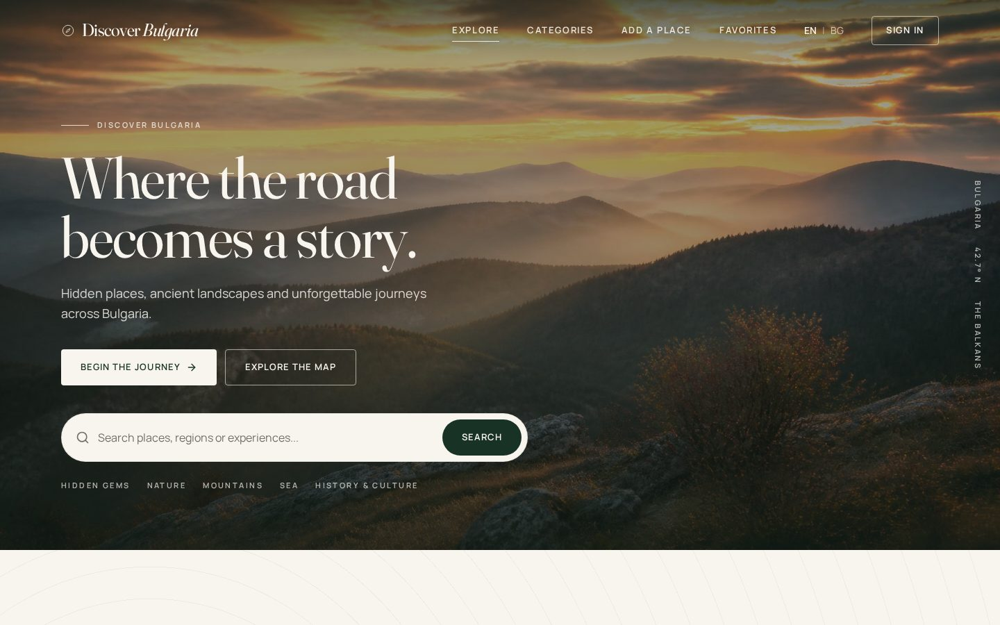
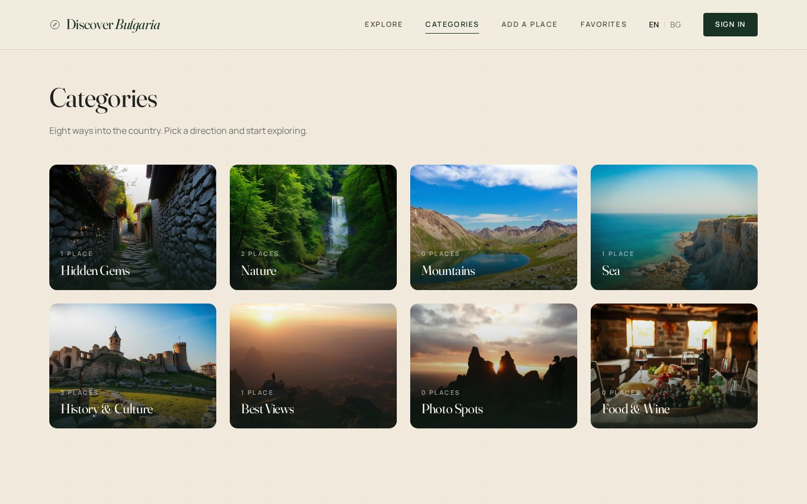
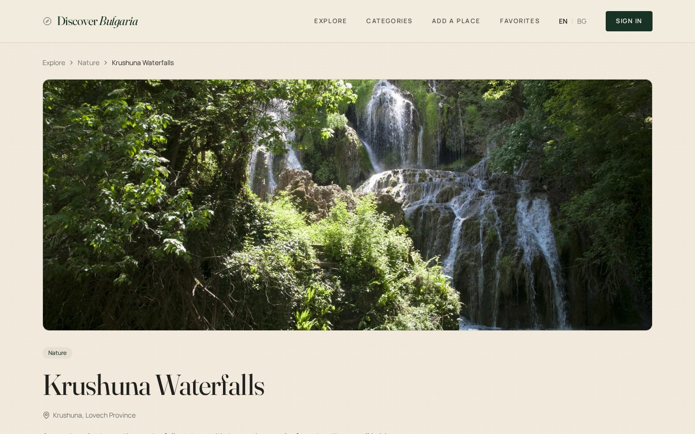
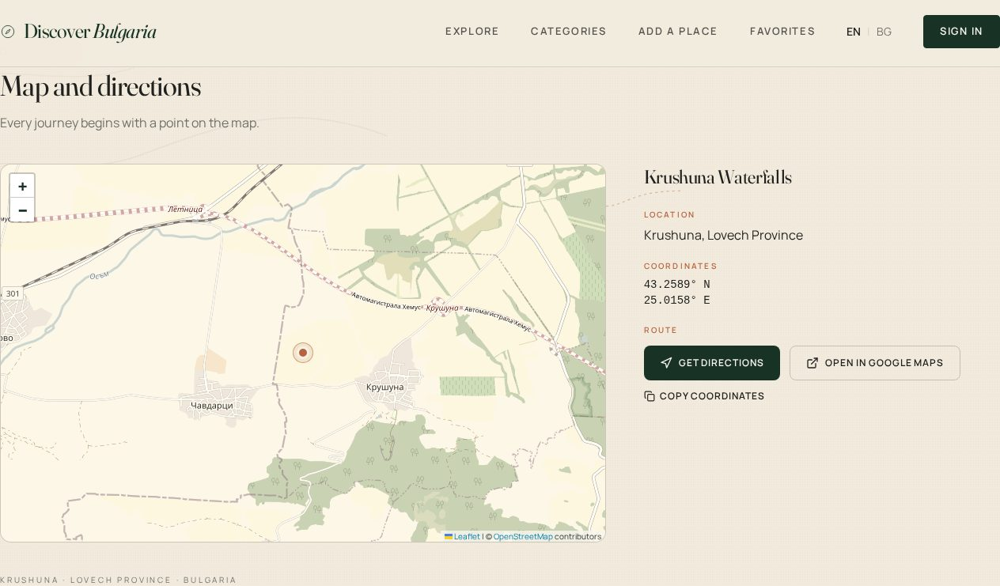

# Discover Bulgaria


> Where the road becomes a story.

Discover Bulgaria is a bilingual travel discovery platform for exploring remarkable, authentic and lesser-known places across Bulgaria.

Visitors can discover destinations, search and browse categories. Registered users can save favorites and contribute new places. Administrators review and moderate community submissions before publication.

## Live Demo

Production: [https://discoverbulgaria.net](https://discoverbulgaria.net)

## Screenshots

### Home page



### Explore and categories



### Place details



### Map and directions




## About the Project

Discover Bulgaria is designed as a community-driven travel discovery platform focused on:

- interesting places across Bulgaria
- natural attractions
- historic and cultural locations
- hidden destinations
- local travel inspiration
- community contributions

The application supports both English and Bulgarian.

## Key Features

- English / Bulgarian localization
- responsive desktop, tablet and mobile interface
- destination search
- category filtering
- dynamic destination pages
- destination photo galleries and uploads
- interactive maps using Leaflet and OpenStreetMap
- Google Maps directions links
- user authentication
- registration and login
- user profile
- Add a Place workflow
- My Places
- Favorites
- photo upload
- moderation workflow
- Admin Dashboard
- Admin Manage Places
- approve / reject functionality
- place statuses:
  - For Review
  - Published
  - Rejected
- Supabase Row Level Security
- SSR with TanStack Start
- automatic Netlify deployment from GitHub

## User Roles

### Visitor

Visitors can:

- browse published destinations
- search
- filter by category
- view destination details
- use maps and directions
- switch between English and Bulgarian

### Registered User

Registered users can additionally:

- save favorites
- add new places
- manage their own submitted places
- edit permitted submissions
- upload destination photos
- manage their profile

### Administrator

Administrators can additionally:

- access the Admin Dashboard
- review submitted places
- approve or reject submissions
- edit and manage all places
- moderate content

## Tech Stack

### Frontend

- React
- TypeScript
- TanStack Start
- Vite
- CSS / existing project styling system

### Backend and Database

- Supabase
- PostgreSQL
- Supabase Auth
- Supabase Storage
- Row Level Security

### Maps

- Leaflet
- OpenStreetMap
- Google Maps external directions

### Development and Deployment

- Lovable
- GitHub
- Netlify
- Bun

## Architecture

```text
Lovable
   ↓
GitHub
   ↓
Netlify
   ↓
discoverbulgaria.net
```

A modern React application with server-side rendering is deployed continuously from GitHub to Netlify. Supabase provides authentication, the PostgreSQL database, storage for destination photos and row-level security policies.

---

Created by [AniDigit](https://www.anidigit.com/) · © 2026 Discover Bulgaria
