# Discover Bulgaria


> Where the road becomes a story.
>
> Там, където пътят се превръща в история.

Discover Bulgaria is a bilingual travel discovery platform for exploring remarkable, authentic and lesser-known places across Bulgaria.

Visitors can discover destinations, search and browse categories. Registered users can save favorites and contribute new places. Administrators review and moderate community submissions before publication.

## Table of Contents

- [Live Demo](#live-demo)
- [Project Context](#project-context)
- [About the Project](#about-the-project)
- [Key Features](#key-features)
- [Screenshots](#screenshots)
- [User Roles](#user-roles)
- [Tech Stack](#tech-stack)
- [Architecture](#architecture)
- [Database Model](#database-model)
- [Submission and Moderation Flow](#submission-and-moderation-flow)
- [Security](#security)
- [Environment Variables](#environment-variables)
- [Local Development](#local-development)
- [Deployment](#deployment)
- [Project Structure](#project-structure)
- [Production QA](#production-qa)
- [Roadmap](#roadmap)
- [Project Status](#project-status)
- [Author](#author)
- [License](#license)

## Live Demo

Production: [https://discoverbulgaria.net](https://discoverbulgaria.net)

## Project Context

Discover Bulgaria was created as a SoftUni AI Apps course project. It demonstrates AI-assisted application development with Lovable, React and TypeScript, TanStack Start, Supabase, GitHub and Netlify.

The project started as a frontend prototype and grew step by step into a deployed full-stack travel platform with:

- authentication
- a PostgreSQL database with row-level security
- file storage for destination photos
- a submission and moderation workflow
- bilingual content in English and Bulgarian
- continuous production deployment

## Screenshots

### Home

| Bulgarian | English |
| --- | --- |
| 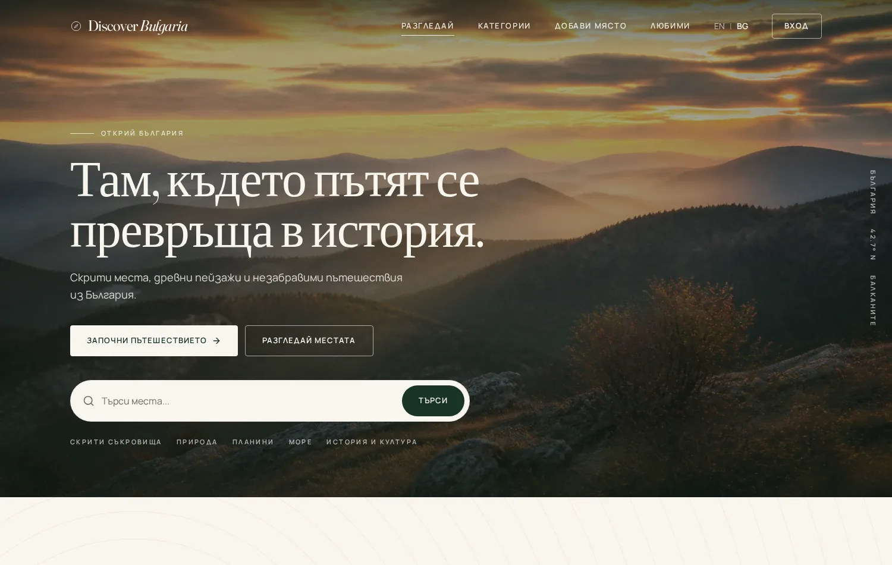 |  |

### Discover

| Categories | Destinations |
| --- | --- |
| 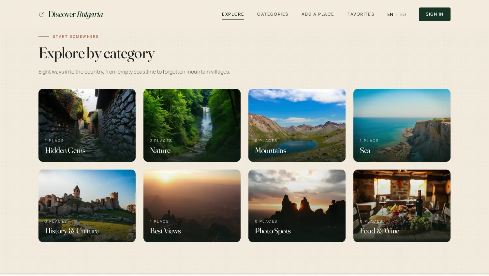 | 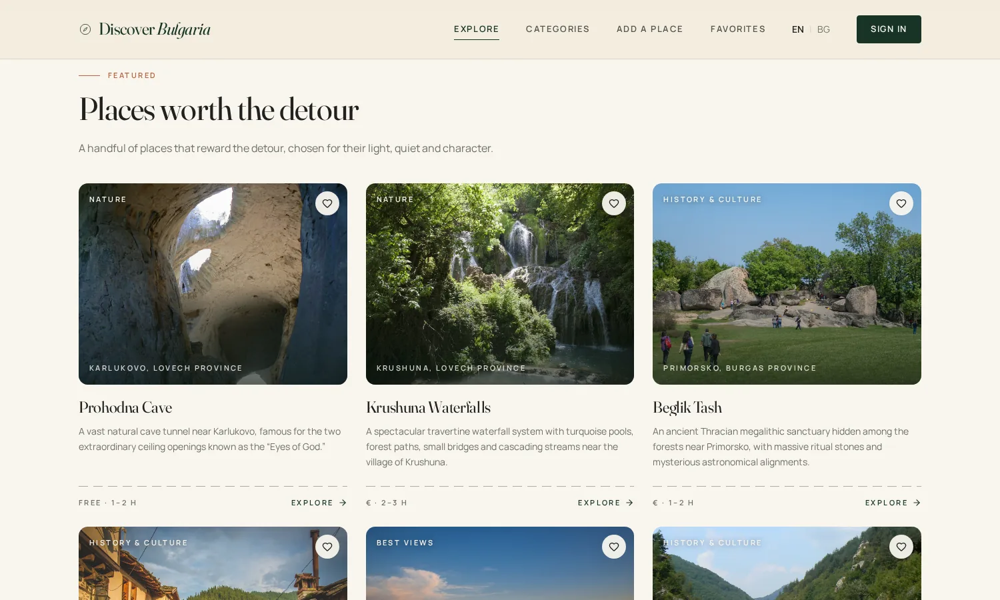 |

### Destination Experience

| Place Details | Map and Directions |
| --- | --- |
| 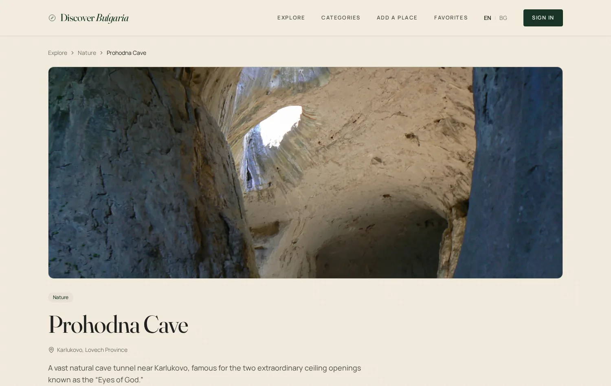 | 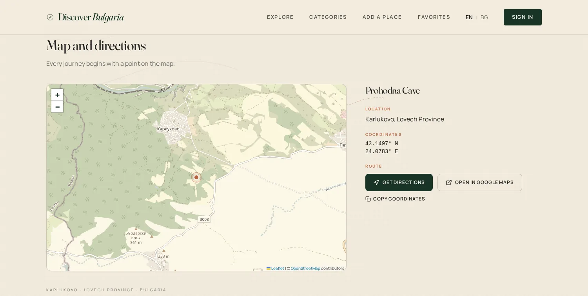 |

### User Experience

| Sign In | Favorites |
| --- | --- |
| 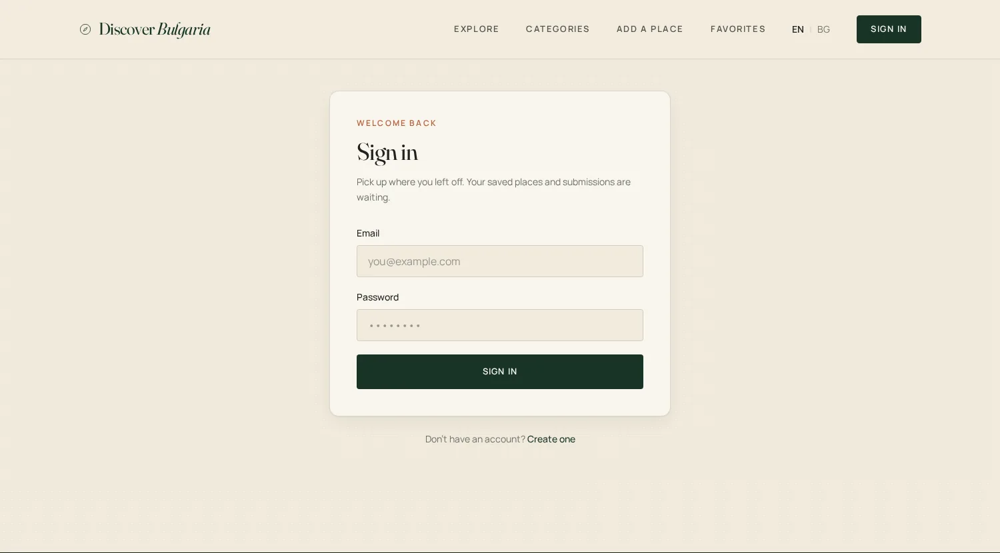 | 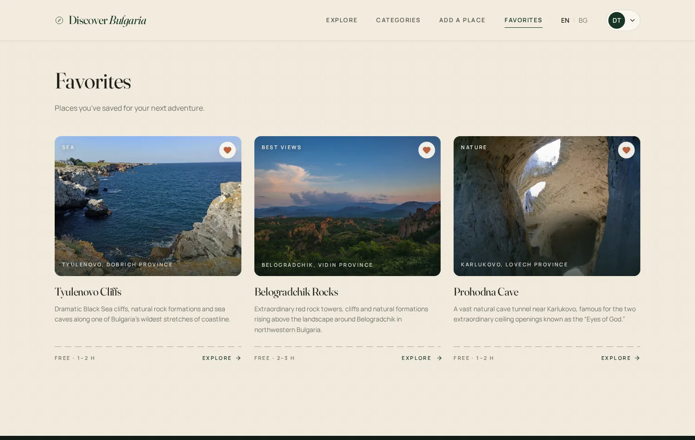 |

### Contribution Workflow

| Add a Place | My Places |
| --- | --- |
| 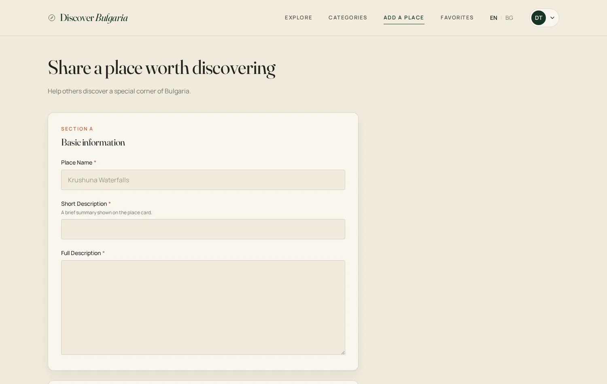 | 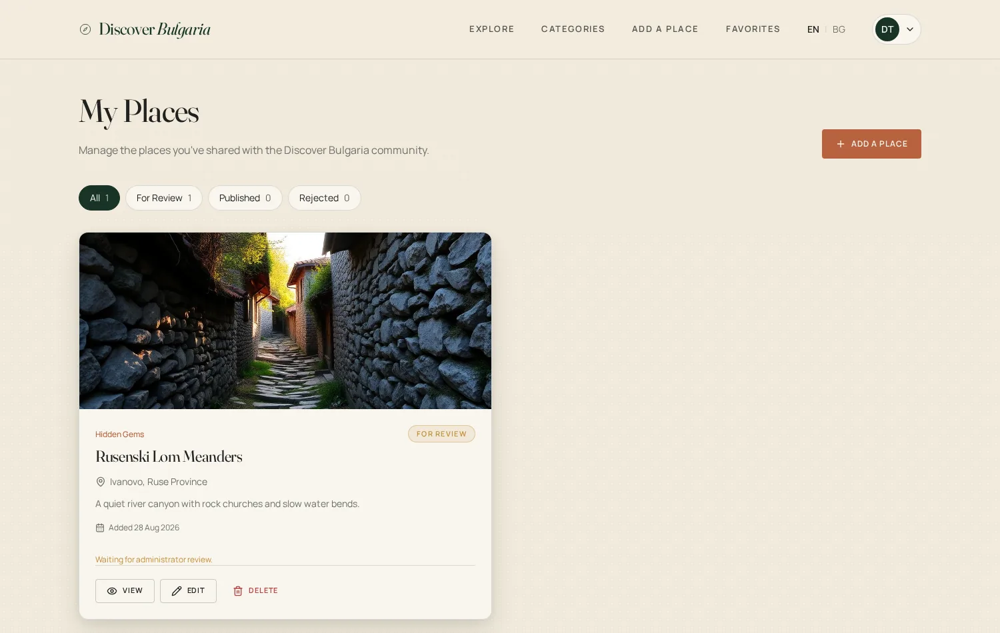 |

### Cinematic Experience

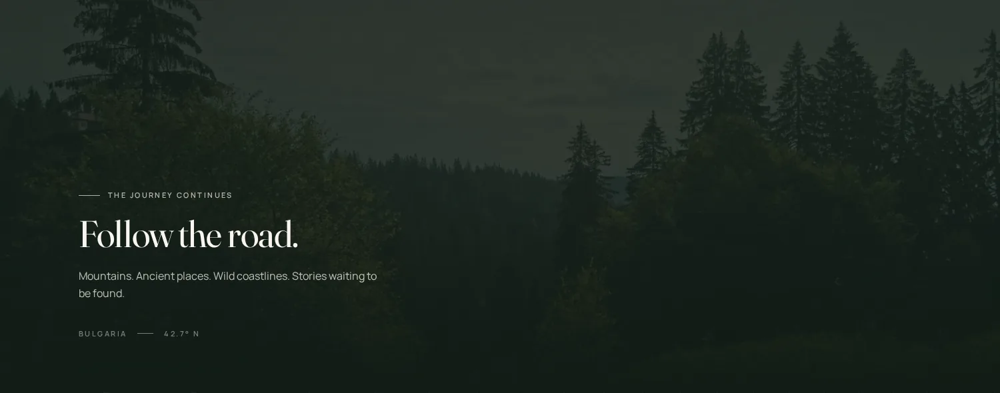

### Mobile

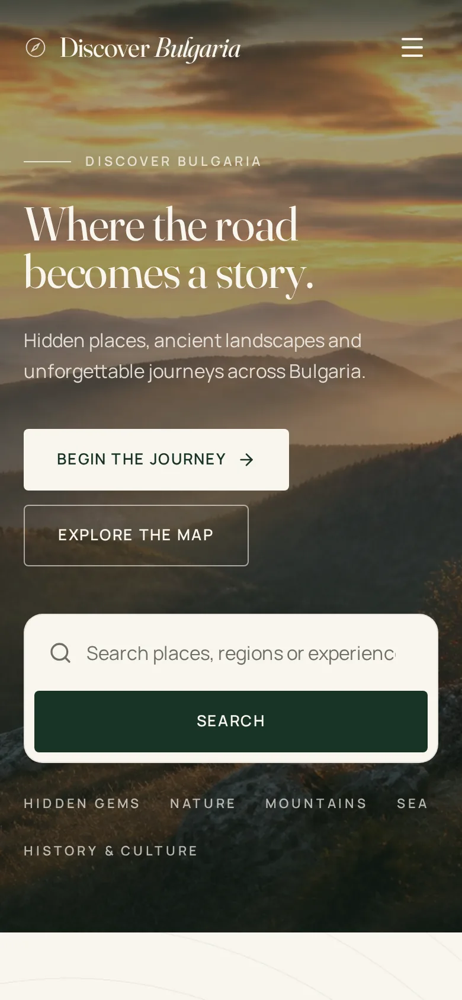

## About the Project

Discover Bulgaria is designed as a community-driven travel discovery platform focused on:

- interesting places across Bulgaria
- natural attractions
- historic and cultural locations
- hidden destinations
- local travel inspiration
- community contributions

The application supports both English and Bulgarian.

## Key Features

- English / Bulgarian localization
- responsive desktop, tablet and mobile interface
- destination search
- category filtering
- dynamic destination pages
- destination photo galleries and uploads
- interactive maps using Leaflet and OpenStreetMap
- Google Maps directions links
- user authentication
- registration and login
- user profile
- Add a Place workflow
- My Places
- Favorites
- photo upload
- moderation workflow
- Admin Dashboard
- Admin Manage Places
- approve / reject functionality
- place statuses:
  - For Review
  - Published
  - Rejected
- Supabase Row Level Security
- SSR with TanStack Start
- automatic Netlify deployment from GitHub

## User Roles

### Visitor

Visitors can:

- browse published destinations
- search
- filter by category
- view destination details
- use maps and directions
- switch between English and Bulgarian

### Registered User

Registered users can additionally:

- save favorites
- add new places
- manage their own submitted places
- edit permitted submissions
- upload destination photos
- manage their profile

### Administrator

Administrators can additionally:

- access the Admin Dashboard
- review submitted places
- approve or reject submissions
- edit and manage all places
- moderate content

## Tech Stack

### Frontend

- React
- TypeScript
- TanStack Start
- Vite
- Tailwind CSS v4 with shadcn/ui (Radix UI primitives) and Lucide icons

### Backend and Database

- Supabase
- PostgreSQL
- Supabase Auth
- Supabase Storage
- Row Level Security

### Maps

- Leaflet
- OpenStreetMap
- Google Maps external directions

### Development and Deployment

- Lovable
- GitHub
- Netlify
- Bun

## Architecture

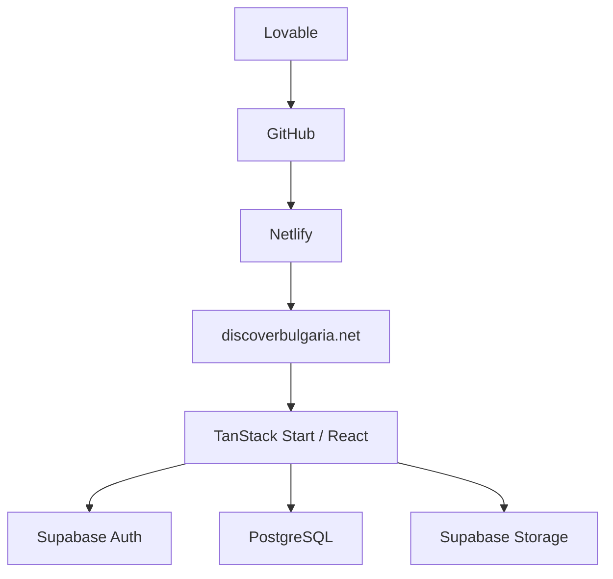

Changes are made in Lovable, pushed to GitHub and deployed automatically by Netlify. Server-side rendering is preserved on Netlify, so the application is not deployed as a static SPA. Supabase provides authentication, the PostgreSQL database, storage for destination photos and row-level security policies.

## Database Model

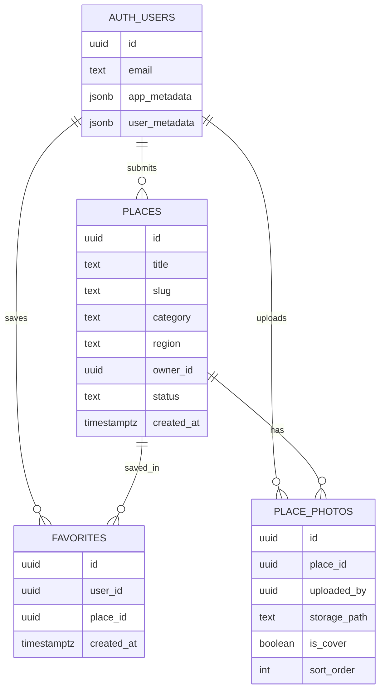

Notes:

- Authentication users live in the Supabase `auth.users` table. There is no separate profiles table, and the display name is stored in user metadata.
- Admin status is stored in Supabase auth app metadata, not in an application table.
- Places carry a moderation status: `for_review`, `published` or `rejected`.
- Photos reference a place and point to an object in Supabase Storage, with one cover photo per place.
- Favorites connect a user and a place.
- Bulgarian translations are stored as optional companion columns on `places`, for example `title_bg` and `short_description_bg`, with English used as a fallback.

## Submission and Moderation Flow

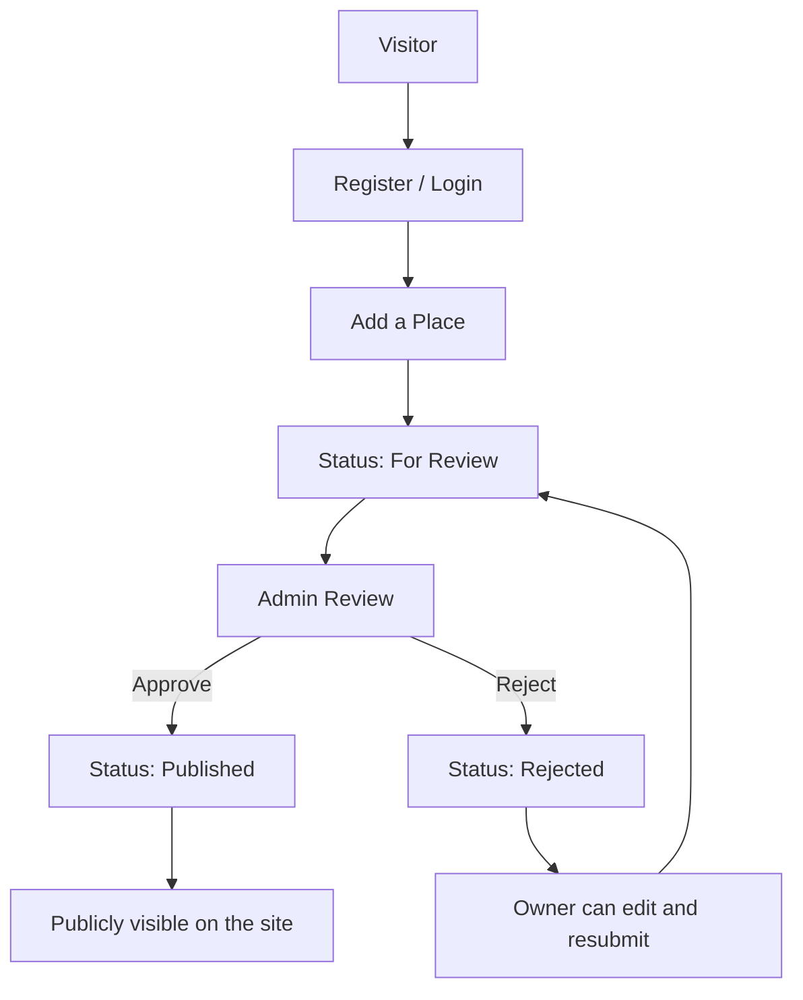

## Security

Access rules are enforced by Supabase Row Level Security, with server-side privileged operations only where moderation requires them.

| Capability | Visitor | Registered User | Administrator |
| --- | :---: | :---: | :---: |
| Read published places | Yes | Yes | Yes |
| Read unpublished places | No | Own only | Yes |
| Create a place submission | No | Yes | Yes |
| Edit or delete a place | No | Own only | Any place |
| Upload photos | No | Own places | Any place |
| Manage favorites | No | Own only | Own only |
| Approve or reject submissions | No | No | Yes |

### Visitor

Can read published places. Cannot see unpublished content, modify places or use favorites.

### Registered User

Can manage their own submissions, create favorites and upload photos for places they own. Edits by a normal user return the place to the For Review status. Cannot manage other users' content or approve places.

### Administrator

Can read, edit and manage all places, approve or reject submissions and moderate content. Administrator status is verified on the server, not in the browser.

### Credentials and secrets

- The Supabase service role key is used only in server-only code and never reaches the browser bundle.
- All secrets are stored as environment variables. Netlify holds the production values.
- The local `.env` file is not committed to Git.
- `.env.example` contains variable names only, with no values.

## Environment Variables

Public, exposed to the browser:

- `VITE_SUPABASE_URL`
- `VITE_SUPABASE_PUBLISHABLE_KEY`
- `VITE_SUPABASE_PROJECT_ID`

Server only:

- `SUPABASE_URL`
- `SUPABASE_PUBLISHABLE_KEY`
- `SUPABASE_PROJECT_ID`
- `SUPABASE_SERVICE_ROLE_KEY`

## Local Development

Requires [Bun](https://bun.sh).

```bash
bun install
cp .env.example .env   # then fill in your own values
bun run dev            # start the development server
```

Available scripts:

```bash
bun run dev        # development server
bun run build      # production build
bun run build:dev  # development-mode build
bun run preview    # preview the production build
bun run lint       # ESLint
bun run format     # Prettier
```

## Deployment

```text
Lovable → GitHub → Netlify → discoverbulgaria.net
```

Changes are made in Lovable, pushed to GitHub and deployed automatically by Netlify. The `main` branch is the production branch. Server-side rendering is preserved on Netlify, so the application is not deployed as a static SPA.

## Project Structure

```text
.
├── public/                 static assets, media and README screenshots
├── src/
│   ├── assets/             images bundled by Vite
│   ├── components/         UI, home, places, admin and auth components
│   ├── data/               static editorial data such as categories
│   ├── hooks/              shared React hooks
│   ├── integrations/       Supabase clients, types and auth middleware
│   ├── lib/                server functions, queries, i18n and helpers
│   ├── routes/             file-based routes, including api and _authenticated
│   ├── router.tsx          router setup
│   ├── server.ts           SSR entry
│   └── styles.css          design system and Tailwind theme
├── supabase/               config and SQL migrations
├── .env.example            variable names only, no values
├── netlify.toml            Netlify build and SSR configuration
├── vite.config.ts          Vite and TanStack Start configuration
├── package.json
└── README.md
```

## Production QA

The following areas are verified against the production site after significant changes:

- home page, hero search and category navigation
- destination search in English and Bulgarian, including Cyrillic queries
- destination detail pages loaded directly by URL
- map section, Get Directions, Open in Google Maps and Copy Coordinates
- language switching across the whole interface
- registration, login, profile and sign out
- favorites, Add a Place, My Places and submission statuses
- admin review, approve and reject
- responsive layout on mobile, tablet and desktop
- production build and TypeScript checks before every deployment

## Roadmap

Possible future improvements:

- richer filtering, for example by region, season or difficulty
- user-facing map of all published destinations
- multi-photo galleries with reordering in the submission form
- saved trip lists and itineraries
- comments or ratings on destinations
- expanded Bulgarian editorial content
- improved analytics and structured data for search engines

## Project Status

Discover Bulgaria is an active production project and continues to receive content, feature and maintenance updates.

## Author

Created by [AniDigit](https://www.anidigit.com/).

## License

All rights reserved unless otherwise specified.

---

Created by [AniDigit](https://www.anidigit.com/) · © 2026 Discover Bulgaria
